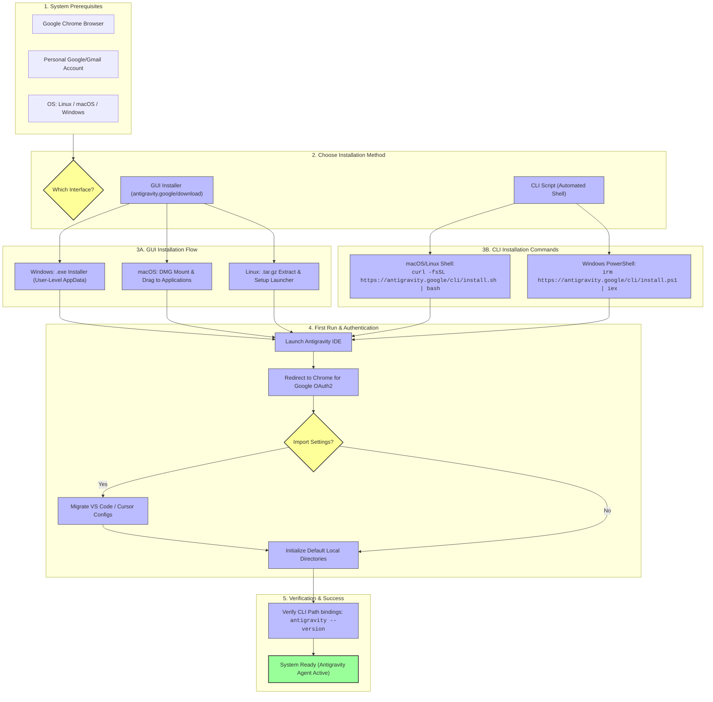
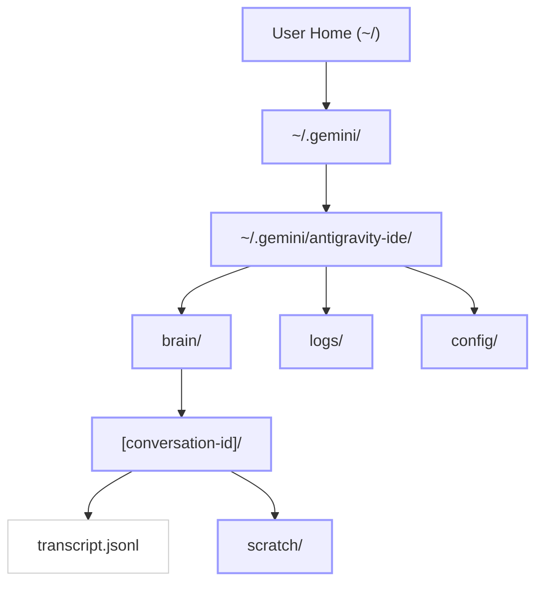
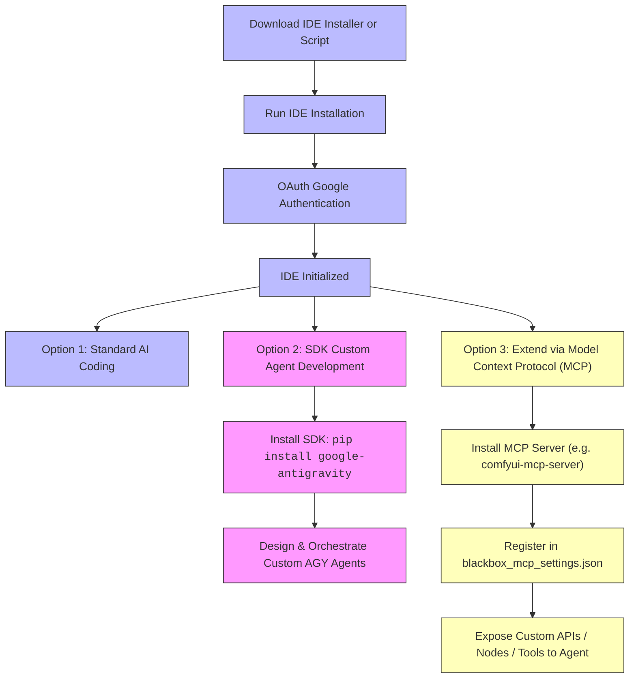

# Google Antigravity Installation Flow & Architecture Graph

This document provides a visual and step-by-step guide mapping the installation, initialization, authentication, and directory structure of the **Google Antigravity IDE** and **Antigravity 2.0 Agent Platform**.

---

## 1. Complete Installation Lifecycle

The flowchart below traces the path from raw system requirements to a fully verified, authenticated Antigravity IDE and Agent Environment.



---

## 2. Directory Layout & Runtime Environment

Once installed, Antigravity structures its application data, workspace metadata, and agent logs within standard user-level directories:



---

## 3. Platform Directory Matrix

| Operating System | App Installation Path | Local Config / AppData Directory |
| :--- | :--- | :--- |
| **Linux** | User bin directory / Custom path | `~/.gemini/antigravity-ide/` |
| **macOS** | `/Applications/Google Antigravity.app` | `~/Library/Application Support/Google/Antigravity/` |
| **Windows** | `%USERPROFILE%\AppData\Local\Programs\GoogleAntigravity\` | `%USERPROFILE%\AppData\Roaming\Google\Antigravity\` |

---

## 4. Post-Installation Verification Checklist

1. **Verify Binary Access**:
   ```bash
   antigravity --version
   ```
2. **Ensure Port Binding (MCP Servers & Local Agent Loop)**:
   Verify that local loopback connections on default agent ports are open.
3. **Verify Auth Credentials**:
   If the agent experiences connectivity issues, run `antigravity login` to trigger a re-authorization token flow via Chrome.

---

## 5. Model Context Protocol (MCP) & Python SDK Installation

For advanced development, you can write custom agents with the Python SDK and register external tools using MCP.

### A. Python SDK Setup
To install the official Google Antigravity Agentic SDK for custom agent engineering:
```bash
pip install google-antigravity
```

### B. MCP Server Registration
Antigravity integrates with external systems via the Model Context Protocol (MCP). To register a server (such as `comfyui-mcp-server` located in this workspace):

1. Edit the configuration settings file:
   - For workspace-specific settings: `blackbox_mcp_settings.json` in the project root.
   - For global settings: `~/.gemini/antigravity-ide/config/mcp.json`.
2. Add your server declaration:
```json
{
  "mcpServers": {
    "github.com/joenorton/comfyui-mcp-server": {
      "type": "streamable-http",
      "url": "http://127.0.0.1:9000/mcp"
    }
  }
}
```

---

## 6. End-to-End Installation Flow with Extensions & SDK

Here is the updated full pipeline, showing the convergence of IDE, SDK, and MCP integrations:



