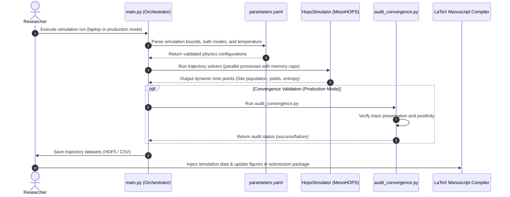

# Quantum Agrivoltaic PT-HOPS Workspace Directory & Architecture Graph

This document details the high-level architecture, directory layout, and component interactions of the entire workspace repository.

---

## 1. Project Organization Overview

The repository contains two active quantum-agrivoltaic research projects and their corresponding simulation frameworks/manuscripts, managed using the **BMad methodology**.

```mermaid
graph TD
    classDef root fill:#f9f,stroke:#333,stroke-width:2px;
    classDef paper1 fill:#bbf,stroke:#333,stroke-width:1px;
    classDef paper2 fill:#bfb,stroke:#333,stroke-width:1px;
    classDef bmad fill:#fbb,stroke:#333,stroke-width:1px;
    classDef config fill:#eee,stroke:#333,stroke-width:1px;

    %% Root Nodes
    Root["Quantum_Agrivoltaic_PT-HOPS/ (Root)"]:::root
    
    %% Root Files
    Root --> Agents["AGENTS.md (Context Sheet)"]:::config
    Root --> Readme["README.md"]:::config
    Root --> Roadmap["ROADMAP.md"]:::config
    Root --> SubStandard["SUBMISSION_STANDARD.md"]:::config
    Root --> EnvYaml["environment.yml"]:::config
    Root --> ReqTxt["requirements.txt"]:::config

    %% BMad Development Config
    Root --> BMad["_bmad/ (BMad Framework)"]:::bmad
    subgraph BMadSub ["BMad Configuration"]
        BMad --> ConfigToml["config.toml"]:::bmad
        BMad --> ConfigUserToml["config.user.toml"]:::bmad
    end

    %% Redac_Paper1 Section
    Root --> Paper1["Redac_Paper1/ (Paper 1: JPCL Revision)"]:::paper1
    subgraph Paper1Sub ["Paper 1: JPCL Project"]
        Paper1 --> P1_Package["JPCL_Submission_Package_2026-06-20/"]:::paper1
        P1_Package --> P1_Tex["Manuscript_JPCL_26-06-20.tex (LaTeX)"]:::paper1
        P1_Package --> P1_SI["SI_JPCL_26-06-20.tex"]:::paper1
        P1_Package --> P1_Resp["Response_to_Reviewers_26-06-20.tex"]:::paper1
        P1_Package --> P1_Cover["Cover_Letter_JPCL_26-06-20.tex"]:::paper1
        
        Paper1 --> P1_Framework["quantum_simulations_framework_parallel_260612/"]:::paper1
        P1_Framework --> P1_Params["parameters.yaml (Physics Config)"]:::paper1
        P1_Framework --> P1_Core["core/ (HopsSimulator, constants.py)"]:::paper1
        P1_Framework --> P1_Models["models/ (QuantumDynamicsSimulator)"]:::paper1
        P1_Framework --> P1_Ext["extensions/ (PT_HopsNoise, SBD_HopsTrajectory)"]:::paper1
        P1_Framework --> P1_Rep["reproducibility/ (main.py, audit_convergence.py)"]:::paper1
        P1_Framework --> P1_Tests["tests/"]:::paper1
    end

    %% Redac_Paper2 Section
    Root --> Paper2["Redac_Paper2/ (Paper 2: Nature Energy)"]:::paper2
    subgraph Paper2Sub ["Paper 2: Nature Energy Project"]
        Paper2 --> P2_Tex["Manuscript_NatureEnergy_26-06-18.tex (LaTeX)"]:::paper2
        Paper2 --> P2_Params["parameters.yaml"]:::paper2
        Paper2 --> P2_Src["src/ (Simulation Code)"]:::paper2
        Paper2 --> P2_Tests["tests/"]:::paper2
        Paper2 --> P2_BmadOut["_bmad-output/"]:::bmad
        
        P2_BmadOut --> P2_BmadPlan["planning-artifacts/"]:::bmad
        P2_BmadPlan --> P2_PRD["prd.md (Product Requirements)"]:::bmad
        P2_BmadPlan --> P2_Arch["architecture.md (Technical Design)"]:::bmad
        P2_BmadPlan --> P2_Epics["epics.md (Sprint Epic Breakdown)"]:::bmad
    end
```

---

## 2. Dynamic Workflow & Core Integrations

The simulation framework runs under Conda/Mamba (`MesoHOP-sim`) and feeds directly into paper figures, manuscript validations, and convergence checks.

---

## 3. Component Details & Descriptions

*   **`Redac_Paper1/`**: Contains the revised manuscript and supporting materials for *The Journal of Physical Chemistry Letters* (JPCL) revision, including point-by-point reviewer response files.
*   **`Redac_Paper1/quantum_simulations_framework_parallel_260612/`**: The canonical simulation code utilizing MesoHOPS (v1.7.0) to model non-Markovian open quantum systems with stochastically bundled dissipators (SBD).
*   **`Redac_Paper2/`**: Focuses on the Nature Energy project, which couples quantum dynamics with FAO-56 microclimate modeling, life-cycle assessment, and IoT BB84 QKD security.
*   **`_bmad/` & `_bmad-output/`**: The workspace planning infrastructure defining product requirements, epics, stories, and solution architectures under BMad methodology.
